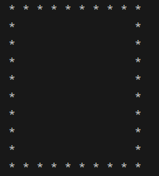

# ✍️ Actividades: sintaxis básica

## Preparación del entorno

Acepta la tarea en _GitHub Classroom_ y clona el repositorio en tu máquina local.

- [https://classroom.github.com/a/aH5CUuUX](https://classroom.github.com/a/aH5CUuUX)

Realiza las actividades en los ficheros indicados y comprueba que funcionan correctamente.

!!! warning
    Es importante evitar el uso de generadores de código automático para realizar las actividades, puesto que el objetivo es practicar la sintaxis de *JavaScript*.

    Si tienes dudas, consulta la documentación o pide ayuda al profesor.

    En caso de existir duda ante la copia o el uso de herramientas de generación de código automático, se pedirá una explicación detallada del código por parte del alumnado implicado. En caso de no poder justificarlo, se considerará copia y se considerará la actividad como no realizada para las partes afectadas.

## Actividad 1 - Media

Crea el fichero **`media.js`** y escribe en él un programa que muestre por consola la media de tres números.

Dadas tres variables numéricas, escribe un programa que muestre por consola la media de los tres números con dos decimales.

Por ejemplo, si los valores son `3`, `5` y `8`, el programa mostrará `5.33`.

## Actividad 2 - DNI

Crea el fichero **`dni.js`** y escribe en él un programa que muestre por consola un DNI con formato y validez.

Dada una variable de entrada que contiene un DNI (ej: `12345678w`), escribe un programa que muestre por consola el DNI con el formato `12345678-W`.

Comprueba que tiene el formato correcto tanto de longitud del número como de letra.

Para comprobar que la letra corresponde a un DNI correcto, se obtiene dividiendo la parte numérica entre `23` y cogiendo de la cadena '`TRWAGMYFPDXBNJZSQVHLCKE`' la letra correspondiente al resto de la división.

Por ejemplo, si el resto es `0` la letra será la `T` y si es `4` será la `G`.

## Actividad 3

Crea el fichero **`act3.js`** que, partiendo de una variable `n` con un número entero, muestre por consola la figura de ejemplo con `n` líneas.

Por ejemplo, si `n = 10`, el programa mostrará:


## Actividad 4

Crea el fichero **`act4.js`** que, partiendo de una variable `n` con un número entero, muestre por consola la figura de ejemplo con `n` líneas.

Por ejemplo, si `n = 10`, el programa mostrará:


## Actividad 5

Crea el fichero **`act5.js`** que, partiendo de una variable `n` con un número entero, muestre por consola la figura de ejemplo con `n` líneas.

Por ejemplo, si `n = 10`, el programa mostrará:



## Actividad 6

Crea el fichero **`act6.js`** que, partiendo de una variable `n` con un número entero, muestre por consola la figura de ejemplo con `n` líneas.

Por ejemplo, si `n = 10`, el programa mostrará:


## Actividad 7

Crea un fichero **`horas.js`**, que dadas dos horas almacenadas en tres variables, `horaInicio`, `horaFin` e `intervalo`, muestre por consola todas las horas que van desde `horaInicio` hasta `horaFin` con un intervalo de `intervalo` minutos.

`horaInicio` y `horaFin` serán cadenas con el formato `HH:MM` e `intervalo` será un número entero.

La salida se mostrará en una sola línea separando las horas por comas.

Comprueba que `horaInicio` y `horaFin` tienen el formato correcto y que `intervalo` es un número entero positivo, en caso contrario muestra un mensaje de error.

Por ejemplo, si `horaInicio = 15:00`, `horaFin = 17:00` e `intervalo = 15`, el programa mostrará:

```
15:00, 15:15, 15:30, 15:45, 16:00, 16:15, 16:30, 16:45, 17:00
```

## Actividad 8

Crea un fichero **`frase.js`** que, dada una cadena de texto, muestre por consola si las siguientes operaciones:

- el número de caracteres (incluyendo espacios)
- el número de palabras
- la frase en mayúsculas
- la frase con la primera letra de cada palabra en mayúsculas
- la frase escrita con las letras al revés
- la frase escrita con las palabras al revés
- si es o no un palíndromo. Una cadena es un palíndromo si se lee igual de izquierda a derecha que de derecha a izquierda sin tener en cuenta los espacios.

Por ejemplo, si la cadena es `Anita lava la tina`, el programa mostrará:

```
Número de caracteres: 18
Número de palabras: 4
Frase en mayúsculas: ANITA LAVA LA TINA
Frase con la primera letra de cada palabra en mayúsculas: Anita Lava La Tina
Frase al revés: anit alav al aval atinA
Frase con las palabras al revés: tina la lava Anita
Es un palíndromo
```

## Actividad 9

Crea un fichero **`password.js`** que, dada una cadena de texto, muestre por consola si es una contraseña segura o no.

Una contraseña es segura si tiene al menos 8 caracteres, contiene al menos una letra mayúscula, una letra minúscula, un número y un carácter especial.

Por ejemplo, si la cadena es `Abc123$`, el programa mostrará `La contraseña es segura`.

