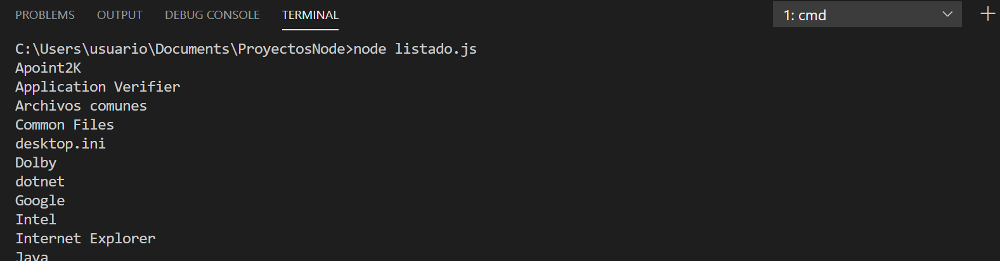

# 2.1 Módulos en Node.js

## Introducción
_Node.js_ es un framework altamente modularizado. Esto significa que está compuesto por numerosos módulos, librerías o paquetes (usaremos estos términos de manera intercambiable). Esta estructura permite que solo agreguemos a nuestros proyectos los módulos que realmente necesitamos.

El núcleo de _Node.js_ incorpora algunas librerías de uso habitual. Por ejemplo:

- **`http`** y **`https`**, para hacer que nuestra aplicación se comporte como un servidor web, o como un servidor web seguro o cifrado, respectivamente.
- **`fs`** para acceder al sistema de archivos
- **`utils`**, con algunas funciones de utilidad, tales como formato de cadenas de texto.

Para ver la lista detallada de módulos podemos consultar [https://nodejs.org/api/](https://nodejs.org/api/), donde aparecen todos los módulos incorporados en el núcleo de _Node.js_.

## Módulos del núcleo de Node.js

Para utilizar cualquier módulo (propio de _Node.js_ o hecho por terceras partes) en una aplicación es necesario incluirlo en nuestro código con la instrucción **`require`**. Recibe como parámetro el nombre del módulo a añadir, como una cadena de texto.

Por ejemplo, vamos a crear un archivo llamado **`listado.js`**. En él vamos a hacer un pequeño programa que utilice el módulo **`fs`** incorporado en el núcleo de _Node.js_ para obtener un listado de todos los archivos y subcarpetas de una carpeta determinada:

```js linenums="1" title="listado.js" hl_lines="1"
const fs = require('fs')
const PATH = 'C:/\Program Files'

fs.readdirSync(PATH).forEach(fichero => {
    console.log(fichero)
})
```

Si ejecutamos este programa en el terminal (recordemos que podemos usar el terminal integrado de _Visual Studio Code_), obtendremos el listado de la carpeta indicada:



## Utilizar módulos propios

Cuando estamos haciendo un proyecto mediano o grande es conveniente descomponer nuestra aplicación en diferentes módulos.

Para hacer esto podemos crear un archivo para cada módulo, y en cada uno de ellos definir las funciones y variables que necesitemos. Para poder utilizar estas funciones y variables en otros módulos, es necesario exportarlas. Para ello, _Node.js_ nos proporciona un objeto llamado **`module.exports`**.

Por ejemplo, dentro de una misma carpeta creamos dos ficheros: `utilidades.js` y `principal.js` dentro de la misma carpeta. El fichero utilidades contendrá:

```js linenums="1" title="utilidades.js" hl_lines="9-12"
// código independiente, si es necesario
console.log('Entrando en utilidades.js')

//funciones
let sumar = (num1, num2) => num1 + num2
let restar = (num1, num2) => num1 - num2

//para exportar funciones es necesario decirlo explícitamente
module.exports = {
    sumar: sumar,
    restar: restar
}
```

Y el fichero principal:

```js linenums="1" title="principal.js" hl_lines="2"
//para usar un módulo es necesario un require:
const utilidades = require('./utilidades')

//Ahora podemos usar las funciones definidas en el módulo:
console.log(utilidades.sumar(3, 2))
console.log(utilidades.restar(3, 2))
```

Si ejecutamos el fichero principal, obtendremos la suma y la resta de los dos números:

```bash
> node principal.js
Entrando en utilidades.js
5
1
```

El objeto **`module.exports`** admite tanto funciones como atributos o propiedades. Por ejemplo, podríamos definir una propiedad para almacenar el valor del número "pi":

```js linenums="1" title="utilidades.js" hl_lines="2"
module.exports = {
    pi: 3.1416,
    sumar: sumar,
    restar: restar
}
```

El ejemplo anterior funcionará siempre que ejecutemos la aplicación _NodeJS_ desde su misma carpeta.

```ps
C:\ProyectosNode\Pruebas\PruebasRequire> node principal.js
```

Pero si estamos en otra carpeta y ejecutamos la aplicación desde allí, no funcionará:
  
```ps
C:\OtraCarpeta> node C:\ProyectosNode\Pruebas\PruebasRequire\principal.js
```

Entonces `require` hará referencia a la carpeta desde donde estamos ejecutando, y no encontrará el archivo `utilidades.js`, en este caso. Para evitar este problema, podemos emplear la propiedad **`__dirname`**, que hace referencia a la carpeta del módulo que se está ejecutando (`principal.js`, en este caso):

```js linenums="1" title="principal.js"
const utilidades = require(__dirname + '/utilidades')
```

## Módulos de terceros. NPM

_**npm**_ (_Node Package Manager_) es un gestor de paquetes para _Javascript_, y se instala conjuntamente con _Node.js_. Podemos comprobar si lo tenemos instalado y cuál es su versión con el siguiente comando:

```bash
npm -v
```

Aunque también nos servirá el comando `npm --version`.

Inicialmente, `npm` se pensó como un gestor para poder instalar módulos en las aplicaciones _Node.js_, pero se ha convertido en mucho más que eso, y a través de él podemos también descargar e instalar en nuestras aplicaciones otros módulos o librerías que no tienen que ver con _Node.js_, como por ejemplo _jQuery_.

El registro de librerías o módulos gestionado por NPM está en la web [https://www.npmjs.com/](https://www.npmjs.com/). En esta web podemos buscar módulos, ver su documentación y ver ejemplos de uso.

## Instalar módulos locales a un proyecto

La configuración básica de los proyectos _Node.js_ se almacena en un archivo JSON llamado "**`package.json`**". Este archivo se puede crear directamente desde línea de comandos:

```bash
npm init
```

Se iniciará un asistente en el terminal para que demos valor a cada atributo de la configuración. Lo más típico es rellenar el nombre del proyecto, la versión, el autor y poco más. Muchas opciones tienen valores por defecto puestos entre paréntesis, por lo que si pulsamos `Intro` se asignará dicho valor sin más.

Para instalar un módulo externo en un proyecto determinado, debemos abrir un terminal y situarnos en la carpeta del proyecto. Después, escribimos el siguiente comando:

```bash
npm install nombre_modulo
```

Vamos a probar con un módulo sencillo y muy utilizado (tiene millones de descargas semanalmente), ya que contiene una serie de utilidades para facilitarnos el desarrollo de nuestros proyectos. Se trata del módulo "**`lodash`**", que podéis consultar en la web citada anteriormente [https://www.npmjs.com/package/lodash](https://www.npmjs.com/package/lodash). Para instalarlo en nuestro proyecto, ejecutamos el siguiente comando:

```bash
npm install lodash
```

Tras ejecutar el comando anterior, se habrá añadido el nuevo módulo en una subcarpeta "**`node_modules/`**" dentro de nuestro proyecto.

Además se modifica el archivo "**`package.json`**" de configuración con el nuevo módulo incluido en el bloque de dependencias:

```json title="package.json"
"dependencies": {
    "lodash": "^4.17.21"
}
```

Para poder utilizar el nuevo módulo, procederemos de la misma forma que para utilizar módulos predefinidos de _Node_: emplearemos la instrucción `require` con el nombre original del módulo, por ejemplo:

```js linenums="1"
const _ = require('lodash')

console.log(_.difference([1, 2, 3], [1]))
```

Si ejecutamos este ejemplo desde el terminal, obtendremos lo siguiente:

```bash
> node principal.js
[ 2, 3 ]
```

Si decidimos subir nuestro proyecto a algún repositorio en Internet como _Github_ o similares, o dejar que alguien se lo descargue para modificarlo después o simplemente para copiar el proyecto en otra carpeta, no es buena idea subir la carpeta "`node_modules/`", ya que puede llegar a ser muy grande. Por lo tanto, lo recomendable es no compartir la carpeta "`node_modules/`", y no es ningún problema hacer eso, ya que gracias al archivo "`package.json`" siempre podemos ejecutar el comando:

```bash
npm install
```

Este comando leerá el archivo "`package.json`" y descargará todos los módulos que se encuentren en él, creando la carpeta "`node_modules/`" y descargando en ella todos los módulos necesarios.

Para desinstalar un módulo (y eliminarlo del archivo "`package.json`", si existe), escribimos el comando siguiente:

```bash
npm uninstall nombre_modulo
```

## Instalar módulos globales al sistema

Para cierto tipo de módulos, aquellos que se ejecutan desde terminal como _Nodemon_ un _watcher_ de _Node.js_, _eslint_ para comprobación de código _Javascript_, _Gulp_ para automatización de tareas, _TypeScript_ para trabajar con este lenguaje, _JSHint_ para comprobación de sintaxis _Javascript_, etc., es conveniente instalarlos de forma global en el sistema para poder usarlos en cualquier proyecto.

La forma de hacer esto es similar a la instalación de un módulo en un proyecto concreto, añadiendo algún parámetro adicional, y con la diferencia de que, en este caso, no es necesario un archivo "`package.json`" para gestionar los módulos y dependencias, ya que no son módulos de un proyecto, sino del sistema. La sintaxis general del comando es:

```bash
npm install -g nombre_modulo
```

donde la opción **`-g`** hace referencia a que se quiere hacer una instalación global.

Es importante tener presente que cualquier módulo instalado de forma global en el sistema no podrá importarse con `require` en una aplicación concreta (para hacerlo tendríamos que instalarlo también de forma local a dicha aplicación).

Por ejemplo, podemos instalar el módulo **`nodemon`**, que es muy útil para el desarrollo, ya que reinicia automáticamente nuestra aplicación cuando detecta cambios en los archivos del proyecto. Para instalarlo globalmente, ejecutamos:

```bash
npm install -g nodemon
```

Una vez instalado, podemos usarlo en cualquier proyecto ejecutando:

```bash
nodemon nombre_archivo.js
```

Otro ejemplo es el módulo **`typescript`**, que permite trabajar con _TypeScript_ en lugar de _JavaScript_. Para instalarlo globalmente, ejecutamos:

```bash
npm install -g typescript
```

Después, podemos compilar archivos _TypeScript_ a _JavaScript_ usando el comando:

```bash
tsc nombre_archivo.ts
```
