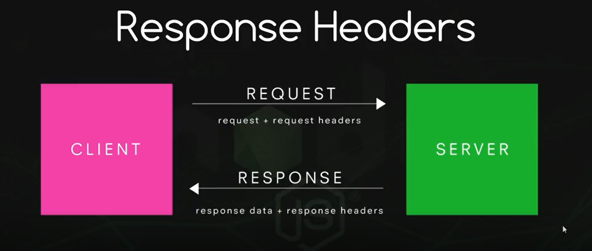
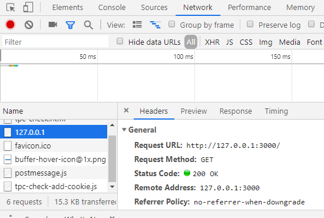

# 2.3 Servidores y ficheros

## Crear un servidor http

Un cliente que realiza una petición a un servidor, que a su vez envía una respuesta, se comunica con el mismo a través de **protocolos**: reglas predefinidas para establecer comunicaciones a través de _sockets_, que son una especie de canal de comunicación mediante TCP o puertos UDP. Cada protocolo de capa de aplicación TCP/IP realiza una función: transmisión de información web, transferencia de archivos, correo electrónico, etc.

La información adicional se envía a través de encabezados.



Por ejemplo, en la respuesta, el servidor le dice al cliente el tipo de contenido que envía para saber qué hacer con él, un navegador mostrará la información html como una página web pero no se mostrará un archivo de texto o json. El estado del envío también aparece en los encabezados de respuesta: `200` si todo correcto, error `404`, etc.

En Node podemos crear servidores http usando el módulo [_**http**_](https://nodejs.org/api/http.html).

```js
const http = require('http')
```

Para crearlo contamos con el método [`createServer`](https://nodejs.org/api/http.html#httpcreateserveroptions-requestlistener) de este módulo, que toma como parámetro una función a su vez con dos parámetros, uno que almacena la petición realizada y otro la respuesta.

```js linenums="1"
const http = require('http')

var server = http.createServer((req, res) => {

})
```

Vamos a especificar el encabezado de respuesta donde diremos que se envía texto sin formato y crearemos el texto sin formato en sí. También es necesario definir un puerto y la IP, usaremos `3000` y como servidor que creamos ahora es local `127.0.0.1`.

```js linenums="1"
const http = require('http')

var server = http.createServer((req, res) => {
    res.writeHead(200, {'Content-Type': 'text/plain'})
    res.end('Hola mundo')
})

server.listen(3000, '127.0.0.1')
```

Para probarlo, ejecutamos el archivo con Node y abrimos un navegador en la dirección `http://127.0.0.1:3000/`.

Si queremos ver los detalles en el navegador, podemos usar la herramienta de desarrollador, en la pestaña de red, y veremos la respuesta del servidor.



Si agregamos cualquier palabra o ruta después del puerto, aún obtendremos la misma respuesta del mismo texto sin formato. Para verlo mejor, agregamos una línea a la función `createServer` para ver la _url_ que envía la solicitud:

```js linenums="1" hl_lines="4"
const http = require('http')

var server = http.createServer((req, res) => {
    console.log(req.url)
    res.writeHead(200, {'Content-Type': 'text/plain'})
    res.end('Hola mundo')
})

server.listen(3000, '127.0.0.1')
```

Aprenderemos a controlar la respuesta con diferentes urls por enrutamiento.

## Sirviendo JSON

JSON es una forma de escribir los datos con notación javascript: https://www.w3schools.com/js/js_json_intro.asp 

https://developer.mozilla.org/es/docs/Learn/JavaScript/Objects/JSON 

Es ampliamente utilizado para enviar datos entre servidores y clientes. Por ello, debemos aprender a enviarlos desde nuestro servidor de nodos.

Lo primero es cambiar el tipo de datos que enviamos. También creamos un objeto JSON simple y podemos pensar en hacer algo como esto:

```js linenums="1"
const http = require('http')

var server = http.createServer((req, res) => {
    console.log(req.url)

    // Cambiamos el tipo de contenido a JSON
    res.writeHead(200, {'Content-Type': 'application/json'})
    
    // Creamos un objeto
    var data = {
        name = 'John',
        job = 'Developer'
        age = 35
    }

    // Convertimos el objeto a JSON y lo enviamos
    res.end(JSON.stringify(data))
})
```

Una solicitud JSON puede provenir de algún código javascript que la crea y luego muestra los datos de cierta manera en el front-end de una página web.

Lo habitual es trabajar con archivos JSON. Podemos combinar los modos asíncrono/sincróno que vimos anteriormente con los métodos que vemos ahora.

## Leer un archivo JSON

**Método 1**: Usar el método `require`: El método más simple para leer un archivo JSON es requerirlo en un archivo Node.js usando el método `require()`.

Sintaxis:

```js
const data = require('ruta/a/archivo/nombre de archivo')
```

Ejemplo: Crear un archivo `users.json` en el mismo directorio donde está presente el archivo `index.js`.

```json title="users.json"
[
  {
    "name": "John",
    "age": 21,
    "languages": [
      "JavaScript",
      "PHP",
      "Python"
    ]
  },
  {
    "name": "Smith",
    "age": 25,
    "languages": [
      "PHP",
      "Go",
      "JavaScript"
    ]
  }
]
```

Para leer el archivo `users.json` en el archivo `index.js` usando el método `require()`.

```js linenums="1" title="index.js"
const users = require('./users.json')

console.log(users)
```

**Método 2**: Usando el módulo `fs`: También podemos usar el módulo `fs` de Node.js para leer un archivo. El módulo _**fs**_ devuelve el contenido de un archivo en formato de cadena, por lo que debemos convertirlo a formato JSON utilizando el método integrado `JSON.parse()`.

Ejemplo:

```js linenums="1" title="index.js"
const fs = require('fs')

// Leer el archivo users.json
fs.readFile('./users.json', (err, data) => {
    if (err) {
        console.log(err)
    } else {
        const users = JSON.parse(data)
        console.log(users)
    }
})
```

## Escribir un archivo JSON

Para escribir un archivo JSON, usamos el método `fs.writeFile()` del módulo `fs`.

Sintaxis:

```js
fs.writeFile('ruta/a/archivo/nombre de archivo', datos, devolución de llamada)
```

Ejemplo. Agregar un nuevo usuario al archivo `users.json` existente, creado anteriormente. Esta tarea se completará en tre pasos:

```js linenums="1" title="index.js"
const fs = require('fs')

// PASO 1: Leer el archivo users.json
const users = require('./users.json')

// PASO 2: Agregar un nuevo usuario
const newUser = {
    name: 'Alex',
    age: 30,
    languages: ['JavaScript', 'Python']
}

users.push(newUser)

// PASO 3: Escribir el archivo users.json
fs.writeFile('./users.json', JSON.stringify(users), (err) => {
    if (err) {
        console.log(err)
    } else {
        console.log('Usuario agregado con éxito')
    }
})
```

