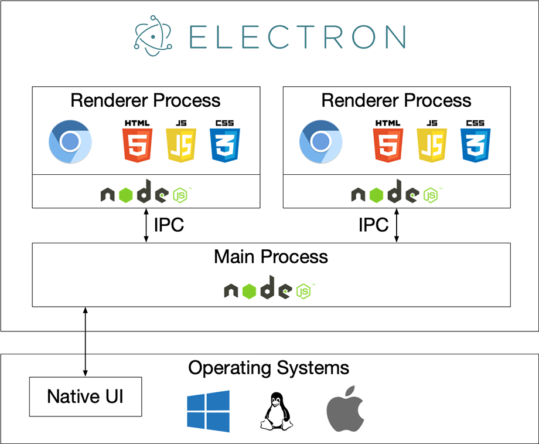
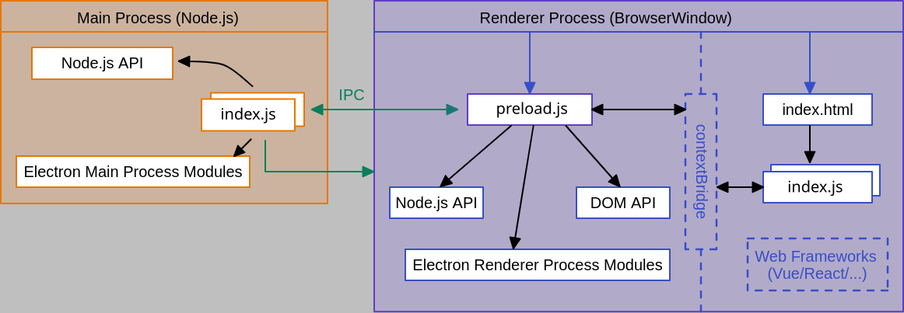

# 3.1 Introducción a Electron

Electron es un **framework** que permite crear **aplicaciones de escritorio multiplataforma** utilizando **tecnologías web** como HTML, CSS y JavaScript. Electron es un proyecto de código abierto desarrollado por la [OpenJS Foundation](https://openjsf.org/) y es utilizado en aplicaciones como Visual Studio Code, Slack, Discord, entre otras.

## Características

- **Multiplataforma**: permite crear aplicaciones de escritorio para Windows, macOS y Linux.
- **Basado en tecnologías web**: utiliza HTML, CSS y JavaScript.
- **Fácil de usar**: no es necesario aprender un nuevo lenguaje de programación.
- **Extensible**: permite utilizar módulos de Node.js.
- **Comunidad activa**: cuenta con una amplia comunidad de desarrolladores.
- **Actualizaciones frecuentes**: se lanzan nuevas versiones con regularidad.
- **Documentación completa**: cuenta con una [documentación detallada](https://www.electronjs.org/docs).
- **Soporte para empaquetado de aplicaciones**: permite empaquetar aplicaciones para distribución.

## Arquitectura

Electron está compuesto por dos procesos principales: el **proceso principal** o _**main process**_ y el **proceso de renderizado** o _**renderer process**_. El **proceso principal** tiene comunicación completa con el sistema operativo y es responsable de crear ventanas nativas y controlar la aplicación, mientras que el **proceso de renderizado** es responsable de mostrar el contenido de las ventanas mediante código HTML, CSS y JavaScript.

<figure markdown="span">
    { width=75% }
    <figcaption>Acquitectura Electron</figcaption>
</figure>

Al ser procesos separados, el **proceso principal** y los **procesos de renderizado** se ejecutan en hilos separados, lo que permite que la aplicación sea más eficiente y no se bloquee si un proceso se detiene. La comunicación entre los procesos se realiza mediante el uso de **mensajes** y **eventos**, este mecanismo se conoce como **Inter-Process Communication (IPC)**.

Para comunicar los diferentes procesos, Electron utiliza un _**preload script**_ que se ejecuta en el contexto de la página web antes de que se cargue cualquier otro script. Esto permite que el _**preload script**_ tenga acceso a Node.js y pueda comunicarse con el **proceso principal**.

<figure markdown="span">
    { width=95% }
    <figcaption>Arquitectura detallada en Electron</figcaption>
</figure>

## Crear una aplicación con Electron

En la unidad introductoria del curso, vimos un tutorial guiado para crear una aplicación de escritorio con Electron. Vamos a repasar los pasos principales para crear una aplicación con Electron:

1. **Inicializar un proyecto con npm**: creamos un directorio para nuestro proyecto y ejecutamos el comando `npm init` para inicializar un proyecto de Node.js, indicando `main.js` como archivo principal.
2. **Configurar el archivo `package.json`**: en el archivo `package.json` añadimos la configuración necesaria para ejecutar nuestra aplicación con Electron, añadiendo en `scripts` un nuevo comando `"start": "electron ."`.
3. **Instalar Electron**: instalamos Electron como dependencia de desarrollo con el comando `npm install electron -D`.
4. **Crear el archivo principal**: creamos un archivo `main.js` que será el punto de entrada de nuestra aplicación.
5. **Configurar el archivo principal**: en el archivo `main.js` configuramos la ventana principal de la aplicación.
6. **Crear la interfaz de usuario**: creamos un archivo HTML y CSS para la interfaz de usuario.
7. **Ejecutar la aplicación**: ejecutamos nuestra aplicación con el comando `npm start`.

Ejemplo de una aplicación básico, con un archivo `main.js` y un archivo `index.html`:

```js linenums="1" title="main.js"
const { app, BrowserWindow } = require('electron')

// Función para crear la ventana principal
const createWindow = () => {
  const win = new BrowserWindow({
    width: 800,
    height: 600
  })

  win.loadFile('index.html')
}

// Crear la ventana cuando la aplicación esté lista
app.whenReady().then(() => {
  createWindow()

  // Cuando se active la aplicación y no haya ventanas, crear una nueva
  app.on('activate', () => {
    if (BrowserWindow.getAllWindows().length === 0) {
      createWindow()
    }
  })
})

// Cerrar la aplicación cuando todas las ventanas estén cerradas
//
// nota: En macOS (darwin), es común que las aplicaciones se mantengan activas
//       hasta que el usuario salga explícitamente con Cmd + Q
app.on('window-all-closed', () => {
  if (process.platform !== 'darwin') {
    app.quit()
  }
})
```

```js linenums="1" title="index.html"
<!DOCTYPE html>
<html>
  <head>
    <meta charset="UTF-8" />
    <meta
      http-equiv="Content-Security-Policy"
      content="default-src 'self'; script-src 'self'" />
    <title>Hola desde Electron renderer!</title>
  </head>
  <body>
    <h1>Hola desde Electron renderer!</h1>
    <p>👋</p>
    <p id="info"></p>
  </body>
</html>
```


