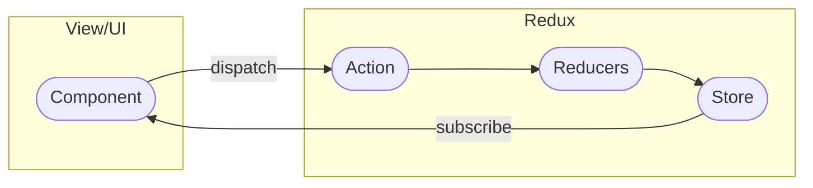

# 4.6 Estado global con Redux

El estado global de una aplicación es el conjunto de datos que se comparte entre todos los componentes de la aplicación.

A medida que una aplicación crece, la gestión del estado se vuelve más complicada, ya que los componentes necesitan compartir datos y comunicarse entre sí, llevando a problemas de _prop drilling_.

React incluye _Context API_ para compartir datos entre componentes, pero no es suficiente para aplicaciones grandes y complejas. Para gestionar el estado de una aplicación de forma eficiente, podemos utilizar _Redux_.

_Redux_ es una librería de gestión de estado que nos permite almacenar y gestionar el estado de nuestra aplicación de forma centralizada. Redux es muy útil en aplicaciones grandes y complejas, ya que facilita la gestión de los datos y la comunicación entre componentes.

## Conceptos de Redux

- **Almacén** (_**Store**_): El almacén es un **objeto** que contiene **todo el estado de la aplicación**.
    - Es la única fuente para el estado y es **inmutable**.
    - Los componentes obtienen y actualizan el estado solo a través del almacén.
- **Acciones** (_**Actions**_): Las acciones son objetos que describen un cambio en el estado.
    - Cada acción debe tener un **tipo único** que indica el tipo de cambio que se realizará.
    - También, pueden llevar **datos** adicionales (como información sobre el cambio) en su propiedad _**payload**_.
- **Reductores** (_**Reducers**_): Los reductores son **funciones** puras que toman el estado actual y una acción y **devuelven un nuevo estado**.
    - Los reductores definen cómo debe cambiar el estado en función del tipo de acción recibida.
    - Deben ser inmutables y no tener efectos secundarios.



La arquitectura de _Redux_ sigue un flujo de datos unidireccional y predecible. Las acciones se envían a través de los reductores, los cuales actualizan el estado en el almacén. Luego, los componentes conectados reciben actualizaciones del almacén y se vuelven a renderizar según sea necesario.

## Instalación

Para añadir _Redux_ a nuestra aplicación de _React_, necesitamos instalar las siguientes dependencias:

- `@reduxjs/toolkit`: Es un conjunto de herramientas que facilitan la gestión de estado con _Redux_.
- `react-redux`: Es una libeería que nos permite conectar _Redux_ con _React_.

```bash
$ npm install @reduxjs/toolkit react-redux
```

### Conceptos clave sobre _Redux Toolkit_

- _**Slices**_: Un _slice_ en _Redux Toolkit_ es una **combinación** de un _**reducer**_ y **acciones** relacionadas en una entidad única.
    - Cada _slice_ representa una **porción** específica **del estado global** de la aplicación.
    - Los _slices_ se crean utilizando la función **`createSlice`**, que maneja la definición de acciones y el reductor correspondiente de manera más concisa.
- **`createSlice`**: Una función que **facilita la creación de _slices_**.
    - Toma un objeto de configuración que incluye el **nombre** del _slice_, el **estado inicial** y las definiciones de **acciones**.
    - Automáticamente genera un _reducer_ y las **acciones** relacionadas.
- **`configureStore`**: Una función que **configura el _store_** de _Redux_.
    - Permite combinar múltiples _reducers_.

### Conceptos clave sobre _react-redux_

- **Provider**: Un componente proporcionado por _react-redux_ que se utiliza para **envolver la aplicación** en el nivel superior.
    - Proporciona el _store_ de _Redux_ a todos los componentes descendientes, permitiéndoles acceder al estado global y despachar acciones.
- **`useSelector`**: Un _hook_ que permite a los componentes de _React_ seleccionar porciones específicas del estado global almacenado en el store de _Redux_.
    - Devuelve los datos seleccionados y se actualiza automáticamente cuando cambian.
- **`useDispatch`**: Un _hook_ que proporciona acceso al _dispatch_ del _store_ de _Redux_.
    - Se utiliza para **enviar acciones que modifican el estado global**.

## Crear un _slice_

Vamos a crear tanto el _store_ como los _slices_ dentro de una nueva carpeta llamada `redux/` dentro de nuestro proyecto (`src/renderer/src/redux/`).

Crearemos un nuevo archivo llamado **`counter-slice.js`** que contendrá el siguiente código:

```js title="src/renderer/src/redux/counter-slice.js" linenums="1"
import { createSlice } from '@reduxjs/toolkit'

const counterSlice = createSlice({
  name: 'counter',
  initialState: { value: 0 },
  reducers: {
    increment: (state) => {
      state.value += 1;
    },
    decrement: (state) => {
      state.value -= 1;
    },
  },
})

export const { increment, decrement } = counterSlice.actions
export default counterSlice.reducer
```

Explicación del código:

1. Se importa la función `createSlice` de `@reduxjs/toolkit`.
2. Se utiliza `createSlice` para definir un _slice_ llamado `counter`. Esto incluye:
    - el nombre del _slice_ (`'counter'`)
    - el estado inicial (`{ value: 0 }`)
    - las definiciones de acciones (`increment` y `decrement`).
3. Dentro de las definiciones de acciones, se proporcionan funciones que actualizan el estado del _slice_.
    - `increment` aumenta el valor del estado en `1`.
    - `decrement` lo disminuye en `1`.
4. Se exportan las acciones `increment` y `decrement` utilizando la notación de desestructuración. Estas acciones pueden ser importadas en otros archivos y utilizadas para despachar acciones.
5. Finalmente, **se exporta el _reducer_** del _slice_ utilizando `counterSlice.reducer`.
    
    El _reducer_ se utilizará más tarde para combinarlo con otros reductores y crear el _store_ de _Redux_.

## Crear un nuevo _store_

Dentro de la carpeta `redux/` crearemos un nuevo archivo `store.js`

```js title="src/renderer/src/redux/store.js" linenums="1"
import { configureStore } from '@reduxjs/toolkit'
import counterReducer from './counter-slice'

export const store = configureStore({
  reducer: {
    counter: counterReducer,
  },
})
```

Explicación del código:

1. Se importa la función `configureStore` de `@reduxjs/toolkit`.
2. Se importa `counterReducer` desde el archivo '`./counter-slice.js`'. Esto es el reductor que hemos definido previamente en el _slice_.
3. Se configura el _store_ de _Redux_ utilizando `configureStore`. Esto implica **combinar _reducers_ en un solo lugar**.
4. Se exporta el _store_ creado utilizando `export const store`. Esto permite que otros archivos de la aplicación accedan y utilicen el _store_.
5. En la configuración del _store_, se especifica el _reducer_ `counterReducer` bajo el campo `reducer`. Esto establece que el reductor `counterReducer` manejará el estado del _slice_ llamado '`counter`'.

## Integrar el _store_ en la aplicación mediante un _Provider_

Para conectar Redux con _React_, necesitamos envolver nuestra aplicación con el componente `Provider` de `react-redux` y pasarle el _store_ como _prop_.

```jsx title="src/renderer/src/main.jsx" hl_lines="5-6 10 12" linenums="1"
import React from 'react'
import ReactDOM from 'react-dom'
import App from './App'

import { Provider } from 'react-redux'
import { store } from './redux/store'

ReactDOM.createRoot(document.getElementById('root')).render(
  <React.StrictMode>
    <Provider store={store}>
      <App />
    </Provider>
  </React.StrictMode>
)
```

## Interactuar con el _store_ desde un componente

Para acceder al estado de _Redux_ en un componente de _React_, podemos utilizar el _hook_ **`useSelector`** de `react-redux`.

```jsx title="src/renderer/src/components/GlobalCounter.jsx" linenums="1"
import React from 'react';
import { useSelector, useDispatch } from 'react-redux';
import { increment, decrement } from './redux/counter-slice';

export function GlobalCounter() {
  const counter = useSelector((state) => state.counter.value)
  const dispatch = useDispatch()

  return (
    <div>
      <h2>Counter: {counter}</h2>
      <button onClick={() => dispatch(increment())}>Increment</button>
      <button onClick={() => dispatch(decrement())}>Decrement</button>
    </div>
  )
}
```

Explicación del código:

1. Se importa _React_ y los _hooks_ `useSelector` y `useDispatch` de `react-redux`.
    - `useSelector` se utiliza para seleccionar partes específicas del estado global.
    - `useDispatch` se utiliza para acceder al despachador de acciones.
2. Se importan las acciones `increment` y `decrement` desde el archivo '`./redux/counter-slice`'. Estas acciones fueron exportadas previamente desde el _slice_.
3. Se define un componente llamado `GlobalCounter`.
4. Dentro del componente, se utiliza el _hook_ `useSelector` para acceder al estado global y seleccionar el valor del contador desde el slice '`counter`'. El valor del contador se almacena en la variable `counter`.
5. Se utiliza el _hook_ `useDispatch` para obtener la función de envío de acciones. La función `dispatch` se utilizará para enviar las acciones `increment` y `decrement` al _store_ de _Redux_.
6. El componente renderiza un título (`<h2>`) que muestra el valor del contador.
7. Hay dos botones, uno para incrementar y otro para decrementar el contador. Cuando se hace clic en cualquiera de estos botones, se llama a la función `dispatch` con la acción correspondiente (`increment()` o `decrement()`), lo que actualiza el estado global.

## Referencias

- [Redux](https://redux.js.org/)

