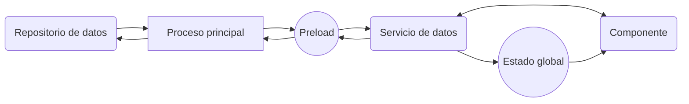

# 5.1 Arquitectura de datos y servicios en una aplicación Electron

Existen múltiples formas de implementar el almacenamiento de datos en una aplicación, desde el uso de archivos locales, bases de datos relacionales, bases de datos no relacionales, hasta servicios de almacenamiento en la nube.

En el caso de una aplicación de escritorio con Electron, es común utilizar bases de datos locales para almacenar datos de forma persistente, ya que permiten acceder a los datos sin necesidad de conexión a internet y ofrecen un rendimiento óptimo para aplicaciones de este tipo, pero también es posible utilizar bases de datos en la nube o servicios de almacenamiento remoto.

## CRUD

El acrónimo **CRUD** (_Create, Read, Update, Delete_) se refiere a las operaciones básicas que se pueden realizar sobre los datos de una aplicación:

- **Create**: Crear un nuevo registro.
- **Read**: Leer un registro existente.
- **Update**: Actualizar un registro existente.
- **Delete**: Eliminar un registro existente.

Estas operaciones son fundamentales en cualquier aplicación que maneje datos, ya que permiten interactuar con la información de forma completa.

## Repositorio de datos

Un **repositorio de datos** es una capa de abstracción que se encarga de interactuar con el almacenamiento de datos de la aplicación. Su objetivo es encapsular la lógica de acceso a los datos y proporcionar una interfaz sencilla y coherente para realizar operaciones CRUD sobre los datos.

Mediante la creación de un **interfaz** unificada para acceder a los datos, se facilita la gestión y mantenimiento de la capa de persistencia, ya que los componentes de la aplicación no necesitan conocer los detalles de implementación del almacenamiento de datos.

En una aplicación _Electron_ los repositorios se implementan en el proceso principal y se comunican con los procesos de renderizado a través del módulo `ipcMain` y `ipcRenderer`.

## Servicios de datos

Los **servicios de datos** son módulos que encapsulan la lógica de acceso a los datos y proporcionan una interfaz para interactuar con los repositorios de datos. Su objetivo es abstraer la complejidad de la capa de persistencia y ofrecer una interfaz sencilla y coherente para realizar operaciones CRUD sobre los datos.

Implementa lógica de negocio y reglas de acceso a los datos, cómo validaciones, transformaciones, cálculos, etc. Proporciona una capa de abstracción entre los componentes de la aplicación y los repositorios de datos, permitiendo una mayor flexibilidad y reutilización del código.

En una aplicación _Electron_ los servicios de datos se implementan en el proceso renderizado y se comunican con los repositorios de datos a través métodos definidos en `preload`.

## Ejemplo

A continuación se muestra un ejemplo de implementación de un repositorio de datos y un servicio de datos en una aplicación _Electron_:



La idea es que el **repositorio de datos** se comunique con el **proceso principal** para realizar operaciones CRUD sobre los datos, y que el **servicio de datos** se comunique con el **repositorio de datos** a través de `preload` para realizar operaciones de negocio y reglas de acceso a los datos.

El **componente** se comunica con el **servicio de datos** para realizar operaciones CRUD sobre los datos, y el **estado global** se utiliza para compartir información entre los componentes de la aplicación.

Esta arquitectura, que en principio puede parecer compleja, ofrece una serie de ventajas:

- **Separación de responsabilidades**: Cada capa de la aplicación tiene una responsabilidad clara y definida, lo que facilita la comprensión y mantenimiento del código.
- **Reutilización de código**: Los servicios de datos y los repositorios de datos son módulos independientes que pueden ser reutilizados en diferentes partes de la aplicación.
- **Escalabilidad**: La arquitectura propuesta es escalable y permite añadir nuevas funcionalidades y componentes de forma sencilla.
- **Testing**: Al separar la lógica de negocio de la capa de persistencia, se facilita la escritura de pruebas unitarias y de integración.
- **Flexibilidad**: La arquitectura propuesta permite cambiar la capa de persistencia sin afectar a la lógica de negocio, y viceversa.

Por supuesto, esta arquitectura es solo una propuesta y puede ser adaptada y modificada según las necesidades y requisitos de la aplicación. Lo importante es mantener una estructura clara y coherente que facilite el desarrollo y mantenimiento del código.

Un ejemplo de implementación de un repositorio de datos, un servicio de datos y un componente en una aplicación _Electron_ se muestra a continuación:

### Repositorio de datos

```js title="main/repository/UserRepository.js"
// Repositorio de datos
class UserRepository {
  constructor(db) {
    this.db = db;
  }

  async create(user) {
    // Implementación de la operación de creación

    // Ejemplo de uso de base de datos local
    return await this.db.insert(user);

    // Ejemplo de uso de fetch
    return await fetch('http://localhost:3000/users', {
      method: 'POST',
      headers: {
        'Content-Type': 'application/json',
      },
      body: JSON.stringify(user),
    });
  }

  async read(id) {
    // Implementación de la operación de lectura
  }

  async update(id, user) {
    // Implementación de la operación de actualización
  }

  async delete(id) {
    // Implementación de la operación de eliminación
  }
}

module.exports = UserRepository;
```

### Proceso principal

```js title="main/main.js"
// Proceso principal
const { app, ipcMain } = require('electron');
const UserRepository = require('./repository/UserRepository');

app.on('ready', () => {
  const userRepository = new UserRepository();

  ipcMain.handle('create-user', async (event, user) => {
    return await userRepository.create(user);
  });

  ipcMain.handle('get-user', async (event, id) => {
    return await userRepository.read(id);
  });

  ipcMain.handle('update-user', async (event, id, user) => {
    return await userRepository.update(id, user);
  });

  ipcMain.handle('delete-user', async (event, id) => {
    return await userRepository.delete(id);
  });
});
```

### Preload script

```js title="preload/preload.js"
// Preload script
const { contextBridge, ipcRenderer } = require('electron');

contextBridge.exposeInMainWorld('api', {
  createUser: (user) => ipcRenderer.invoke('create-user', user),
  getUser: (id) => ipcRenderer.invoke('get-user', id),
  updateUser: (id, user) => ipcRenderer.invoke('update-user', id, user),
  deleteUser: (id) => ipcRenderer.invoke('delete-user', id),
});
```

### Servicio de datos

```js title="renderer/services/UserService.js"
// Servicio de datos
class UserService
{
  constructor() {
    this.api = window.api;

    // función ficticia para obtener el estado global de la aplicación
    this.state = obtenerEstadoGlobalDeLaAplicación();
  }

  async createUser(user) {
    // Implementación de la operación de creación de usuario

    // validaciones
    if (!user.name || !user.email) {
      throw new Error('name and email are required');
    }

    this.state.showLoadingMessage('Creando usuario...');

    // Ejemplo de uso de API REST

    await this.api.createUser(user)
      .then(result => {
        // Manejo de la respuesta
        console.log(result)
       })
      .catch(error => {
        // Manejo del error
        console.error(error)
      })
      .finally(() => {
        // Código a ejecutar siempre
        this.state.hideLoadingMessage();
      });
  }

  async getUser(id) {
    // Implementación de la operación de obtención de usuario
  }

  async updateUser(id, user) {
    // Implementación de la operación de actualización de usuario
  }

  async deleteUser(id) {
    // Implementación de la operación de eliminación de usuario
  }
}
```

### Componente

```js title="renderer/components/UserForm.js"
// Componente UserForm
export default function UserForm() {
  const userService = new UserService();

  const handleSubmit = async (event) => {
    event.preventDefault();

    const user = {
      name: event.target.name.value,
      email: event.target.email.value,
    };

    try {
      await userService.createUser(user);
    } catch (error) {
      console.error(error);
    }
  };

  return (
    <form onSubmit={handleSubmit}>
      <input type="text" name="name" placeholder="Name" />
      <input type="email" name="email" placeholder="Email" />
      <button type="submit">Create User</button>
    </form>
  );
}
```

